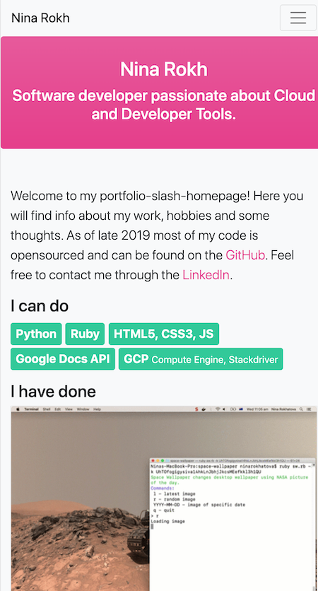

# In Action #
A link (URL) to your published portfolio website
A link to your GitHub repository (repo)

# About #

## Purpose ##
* Learn tech stack for static web-sites (HTML/CSS)
* Learn how to design, develop and deploy a website.
* Communicate my knowledge, skills and expectations to prospective employers.

## Functionality / features ##
* Blog
* Contact form

## Sitemap ##
* root
  * Home
  * About 
  * Blog
    - Post 1
    - ...
  * Contact Info

## Screenshots ##
### Home page ####
Desktop            |  Mobile
:-------------------------:|:-------------------------:
  |  

### About ####
Desktop            |  Mobile
:-------------------------:|:-------------------------:
  |  

### Blog ####
Desktop            |  Mobile
:-------------------------:|:-------------------------:
  |  

### Contact Info ####
Desktop            |  Mobile
:-------------------------:|:-------------------------:
  |  

## Target audience ##
1. Recruiters 
1. Hiring Managers
1. Peers

## Tech stack ##
1. Bootstrap
2. Font Awesome
3. SCSS
4. HTML5
5. CSS3
6. Node.js

# Deployment #

## Compilation ##

The styles need to be compiled before deployment.
Install Node.js (npm) and run the follwoing commands in the root of this repository.

Install dependencies listed in package.json:
` npm install `

Start service that re-compiles css every time scss is modified:
` npm run scss `

Use the contents of the folder `css` for deployment.

## Upload ##
TBD
